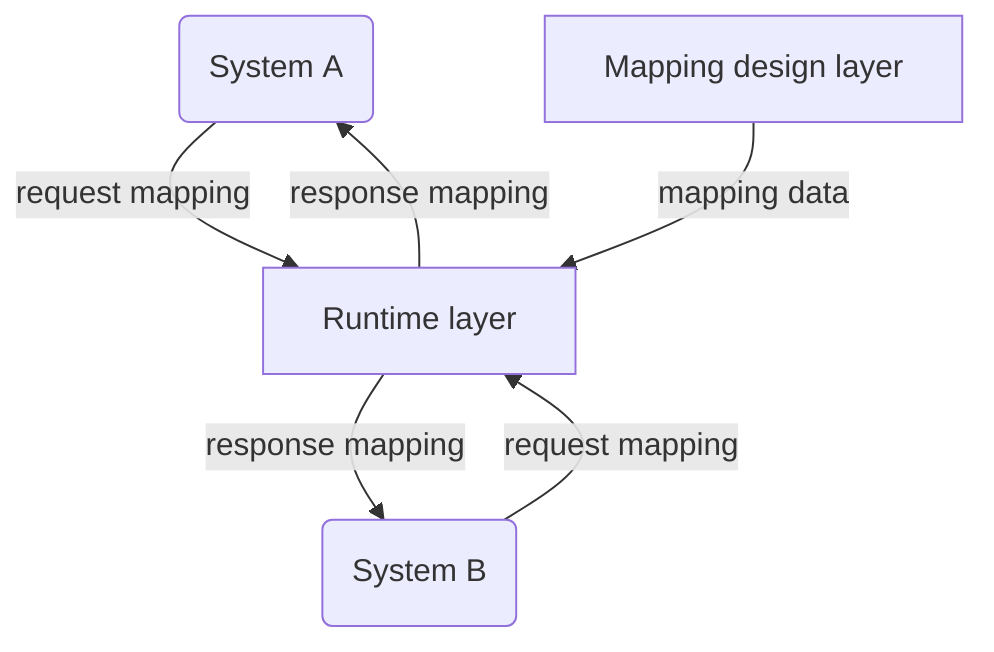
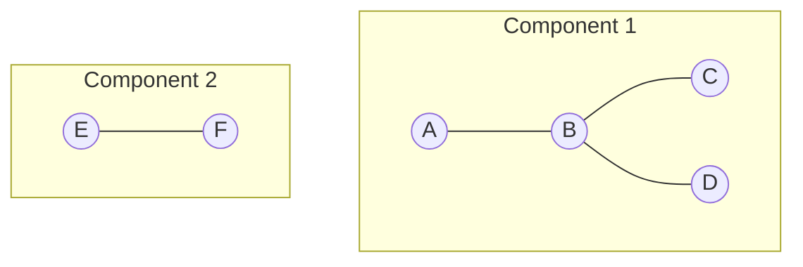
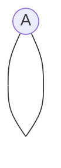
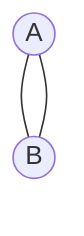
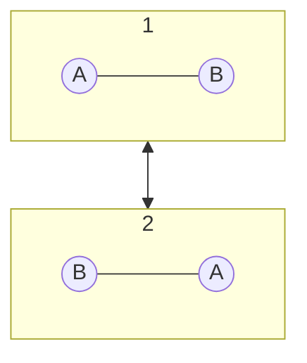
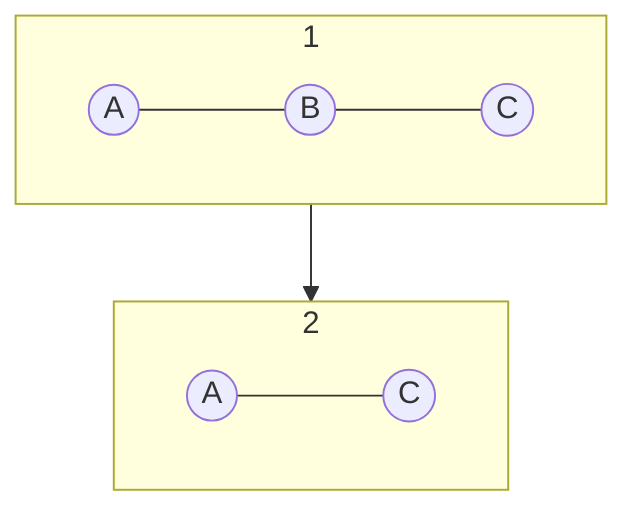
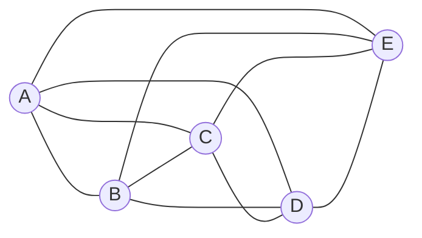
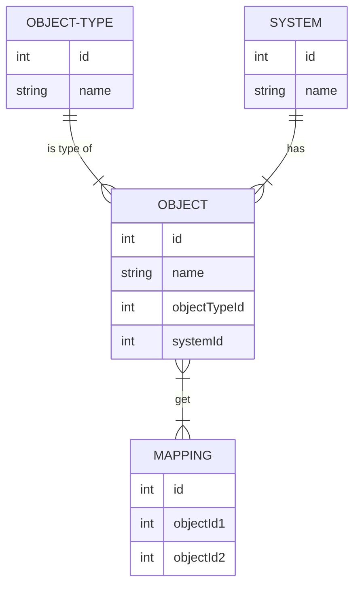

# Relation Data Management: Система управления справочниками и сопоставлением сущностей

## Введение

Данная система предназначена для формирования связей и описания взаимодействия произвольных объектов в произвольных системах. Сформированные связи объектов(маппинг) хранятся в реляционной СУБД и могут быть запрошены в реальном времени для получения одной системой значений для связанного объекта из другой(-их) систем.

На логическом уровне система разделяется на два слоя - слой проектирования маппинга и исполнительный слой.

## Глоссарий

**Маппинг** - связь двух и более объектов одного класса 

**Класс объекта** - признак, по которому объекты объединяются в обособленный справочник для маппинга

**Вершина графа** - элемент графа, обозначающий произвольный объект. 

**Ребро графа** - элемент графа, обозначающий связь между двумя вершинами.

**Компонента связности** - элемент графа, включающий множество вершин, связанных ребрами.

**Смежная вершина** - вершина, для которой существует хотя бы одно ребро, не являющееся петлей

**Петля** - ребро, соединяющее одну и ту же вершину

**Кратные ребра** - ребра, соединющие две одинаковые вершины

**Модель данных** - формализованная структура данных, например: граф, XSD, JSON Schema

## Краткая теоретическая часть

Для проектирования маппинга используется логика построения графа, при котором объекты систем являются вершинами графа, записи о связях между объектами - ребрами графа, степени вершин - кол-во связанных систем для выбранного объекта.

Концептуально RDM представляет собой неориентированный невзвешенный граф, состоящий из N компонент связности, где N - количество классов объектов, используемых в маппинге. 

Любая компонента связности должна отвечать условиям:  
- Наличие хотя бы двух смежных вершин
- Отсутствие петель
- Отсутствие кратных ребер  

Связи в RDM реализуют свойства бинарных операций:

- Коммутативность
  
  Если объект A связан с объектом B одним маппингом, то для объекта A всегда будет получен маппинг с объектом B и наоборот.

- Ассоциативность

  Если объект А связан с объектом В, а объект В связан с объектом С, то для объекта А можно получить маппинг с объектом С

Оптимальный маппинг с точки зрения системы будет выглядеть, как полный граф, соединяющий все объекты данного класса друг с другом.

## Основные функции RDM

- Сопоставление различных идентификаторов объектов одного класса в различных системах
- Сопоставление наборов маппингов между данными и моделями хранения данных
- Сопоставление справочных типов моделей данных между моделями
- Хранение экземпляров справочников для типов данных

## Обработка и хранение данных

Хранение данных в RDM производится в реляционной СУБД, пример минимальной логической схемы данных:

Где OBJECT-TYPE и SYSTEM - минимальный набор справочников для реализации маппинга, OBJECT - хранилище экземпляров объектов заданного типа и заданной системы, MAPPING - хранилище связей обхетов.  
> Допустимо расширение структуры, например, добавлением дополнительных справочников, если в рамках маппинга это требуется.

Хранение различных типов сущностей предполагается в отельной структуре таблиц, объединенных логически(например, схемой) для разделения различных типов данных и, соответственно, маппингов.

Обработка данных может быть выполнена любым решением, подразумевающим обработку бизнес-правил, в т.ч. решениями класса BPM, либо самописным модулем, реализующим 
- CRUD-взаимодействие с БД
- механизм создания новых типовых структур данных.

Основные необходимые модули:
- Запись и чтение маппингов для существующих типов данных
- Добавление новых систем и типов данных
- Создание и управление правил маппинга для систем

## Взаимодействие со смежными системами

Доступ к данным маппинга и создание новых экземпляров маппинга осуществляется посредством API.   Стандартный вариант - REST API, однако при необходимости допустима реализация на базе любого протокола/методологии.

### Стандартные методы взаимодействия

1. Создание связи  
    Осуществляет связь между объектами одного типа, принадлежащим к разным системам  
    **Входящие данные:** Система и идентификатор записи для каждого объекта, тип данных  
    **Исходящие данные:** Результат создания связи, успешно/ошибка    
2. Разрешение связи  
    Возвращает существующую связь между объектами одного типа.  
    **Входящие данные:** Система и идентификатор записи искомого объекта, тип данных  
    **Исходящие данные:** Система и идентификатор записи найденных объектов    
3. Разрыв связи  
    Удаляет связь между объектами одного типа, принадлежащим к разным системам
    **Входящие данные:** Система и идентификатор записи для каждого объекта, тип данных  
    **Исходящие данные:** Результат разрыва связи, успешно/ошибка  
4. Создание записи  
    Создает запись в справочнике. 
    > Здесь и далее: Допустимо создание записи как во вспомогательном справочнике, так и в перечне объектов.  

    **Входящие данные:** Наименование справочника, наименование записи  
    **Исходящие данные:** Идентификатор записи/ошибка   
5. Редактирование записи  
    Изменяет существующую запись в справочнике. 
    **Входящие данные:** Наименование справочника, идентификатор записи, новое наименование записи  
    **Исходящие данные:** Идентификатор записи/ошибка    
6. Слияние записей  
    Изменяет существующую запись в справочнике, в случае ее отсутствия создает новую  
    **Входящие данные:** Наименование справочника, идентификатор записи, новое наименование записи  
    **Исходящие данные:** Идентификатор записи/ошибка   
7. Удаление записи  
    Удаляет существующую запись в справочнике  
    **Входящие данные:** Наименование справочника, идентификатор записи  
    **Исходящие данные:** Результат удаления, успешно/ошибка   

## Проблемы, которые решает RDM

## Примеры взаимодействия

