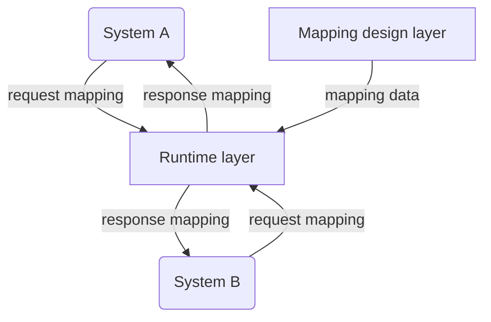
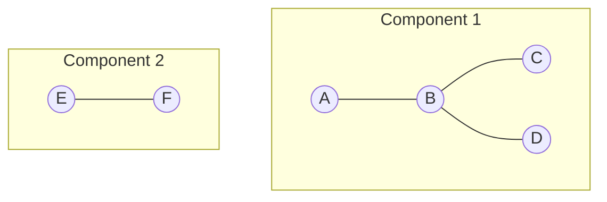
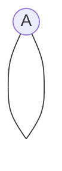
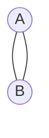

# Relation Data Management: Система управления справочниками и сопоставлением сущностей

## Введение

Данная система предназначена для формирования связей и описания взаимодействия произвольных объектов в произвольных системах. Сформированные связи объектов(маппинг) хранятся в реляционной СУБД и могут быть запрошены в реальном времени для получения одной системой значений для связанного объекта из другой(-их) систем.

На логическом уровне система разделяется на два слоя - слой проектирования маппинга и исполнительный слой.

## Глоссарий

**Маппинг** - связь двух и более объектов одного класса 

**Класс объекта** - признак, по которому объекты объединяются в обособленный справочник для маппинга

**Вершина графа** - элемент графа, обозначающий произвольный объект. 

**Ребро графа** - элемент графа, обозначающий связь между двумя вершинами.

**Компонента связности** - элемент графа, включающий множество вершин, связанных ребрами.

**Смежная вершина** - вершина, для которой существует хотя бы одно ребро, не являющееся петлей.

**Петля** - ребро, соединяющее одну и ту же вершину

**Кратные ребра** - ребра, соединющие две одинаковые вершины

## Краткая теоретическая часть

Для проектирования маппинга используется логика построения графа, при котором объекты систем являются вершинами графа, записи о связях между объектами - ребрами графа, степени вершин - кол-во связанных систем для выбранного объекта.

Концептуально RDM представляет собой планарный неориентированный невзвешенный граф, состоящий из N компонент связности, где N - количество классов объектов, используемых в маппинге. 

Любая компонента связности должна отвечать условиям:  
- Наличие хотя бы двух смежных вершин
- Отсутствие петель
- Отсутствие кратных ребер  

Оптимальный маппинг с точки зрения системы будет выглядеть, как полный граф, соединяющий все объекты данного класса друг с другом.

## Основные функции RDM

## Обработка и хранение данных

## Взаимодействие со смежными системами

## Проблемы, которые решает RDM

## Примеры взаимодействия

